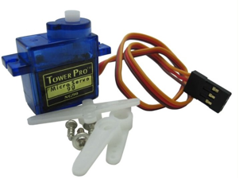

# Servo Control

## Experiment 18 -Steering gear control experiments

The steering gear is a position servo drive consisting essentially of a housing, a circuit board, a coreless motor, a gear and position detector. The working principle is to send a signal from the receiver or micro-controller to the steering gear, which has a reference circuit inside, resulting in a cycle of 20ms, width of 1.5ms reference signal, the DC bias voltage and the potentiometer voltage comparison, Voltage difference output. Through the IC on the circuit board to determine the direction of rotation, and then drive the coreless motor began to rotate, through the reduction gear power transmission to the swing arm, while the position detector to send back the signal to determine whether the positioning has been reached. For those who need to change the angle and can maintain the control system. When the motor speed is constant, through the cascade reduction gear drive potentiometer rotation, making the voltage difference is 0, the motor stops rotating. The angle range of the general steering gear rotation is 0 degrees to 180 degrees.



There are many specifications of the steering gear, but all the steering gear has an external three lines, respectively, with brown, red, orange three colors to distinguish, because the steering gear brand is different, the color will be different, brown for the ground wire, red Power supply positive line, orange for the signal line.


The angle of rotation of the steering gear is achieved by adjusting the duty cycle of the PWM (Pulse Width Modulation) signal. The period of the standard PWM (Pulse Width Modulation) signal is fixed at 20 ms (50 Hz), and the theoretical pulse width distribution should be in the range of 1 ms 2ms, but in fact the pulse width can be between 0.5ms and 2.5ms, pulse width and steering gear angle 0 ° ~ 180 ° corresponds. There is little room to note, because the steering gear brand is different, for the same signal, different brands of steering wheel rotation angle will be different.


After understanding the basics we can learn to control a steering gear, and the components required by this experiment rarely need a steering gear, a jumper can be a bar.
RB-412 Actuator * 1
Breadboard jumper * 1 bar
There are two ways to control the steering gear with Arduino. One is to generate a different square wave with a duty cycle by Arduino's common digital sensor interface. The PWM signal is used to simulate the steering gear. The second is the direct use of Arduino's own Servo Function of the steering gear control, the advantages of this control method is programmed, the disadvantage is only control 2-way steering gear, because Arduino own function can only use the number 9,10 interface. Arduino's drive capability is limited, so an external power supply is required when more than one steering gear needs to be controlled.


Method One: See Code
```c
// Geraldo Braho


int servopin=9;  // Define the digital interface 9 to connect the servo servo signal cable
int myangle;  // Define the angle variable
int pulsewidth; // Define pulse width variables
int val;
void servopulse(int servopin,int myangle) // Define a pulse function
{
pulsewidth=(myangle*11)+500;  // The angle is converted to the pulse width value of 500-2480
digitalWrite(servopin,HIGH);  // The steering gear interface level is high
delayMicroseconds(pulsewidth);  // Delayed pulse width of the number of microseconds
digitalWrite(servopin,LOW); // The steering gear interface level to low
delay(20-pulsewidth/1000);
}
void setup()
{
pinMode(servopin,OUTPUT); // Set the servo interface as the output interface
Serial.begin(9600); // Connect to the serial port with a baud rate of 9600
Serial.println("servo=o_seral_simple ready" ) ;
}
void loop() //Change the number of 0 to 9 to 0 to 180 and let the LED flash the number of times
{
val=Serial.read();  //Read the value of the serial port
if(val>'0'&&val<='9')
{
val=val-'0';  // Transforms the feature quantity into a numerical variable
val=val*(180/9);  // Convert the number to an angle
Serial.print("moving servo to ");
Serial.print(val,DEC);
Serial.println();
for(int i=0;i<=50;i++) // Give the steering gear enough time to turn it to the specified angle
{
servopulse(servopin,val); // Reference pulse function
}
}
}

```


Method Two

The first specific analysis of Arduino comes with the Servo function and its statement, to introduce the servo function of several commonly used statements it.
1, attach (interface) - set the interface of the steering gear, only the number 9 or 10 interface available.
2, write (angle) - used to set the steering wheel rotation angle of the statement, you can set the angle range is 0 ° to 180 °.
3, read () - used to read the steering angle of the statement, can be understood as read the last one (write) command
The value.
4, attached () - to determine whether the servo parameters have been sent to the steering gear interface.
5, detach () - separates the servo from its interface, and the interface (number 9 or 10 interface) can continue to be used as a PWM interface.
Note: The above statement is written in the form of "steering variable name." Specific statement () "For example: myservo.attach (9).
Still connect the steering gear to the digital 9 interface.

Reference source B:
```c
#include <Servo.h>//Define the header file, here's one thing to note that it can be done directly
Arduino Click the software menu bar Sketch>Importlibrary>Servo,
Transefer Servo function，Can also be entered directly  #include <Servo.h>，But in the input should pay attention to  #include versus <Servo.h> There must be a space between, or compile error.
Servo myservo;// Define the servo variable name
void setup()
{
myservo.attach(9);// Define the steering gear interface (9,10 can be, the shortcomings can only control two）
}
void loop()
{
myservo.write(90);// Set the angle of rotation of the steering gear

}
```
These are two ways to control servos, each with advantages and disadvantages we choose according to their preferences and needs。
