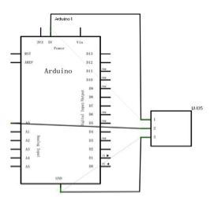
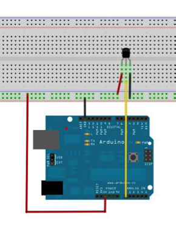

# Routine 12LM35 temperature sensor experiment


LM35 is a very common and easy to use temperature sensor components, components in the application of only need a LM35 components, only the use of an analog interface can be difficult is that the algorithm will read the analog value is converted to the actual temperature.
The required components are as follows.
1. Straight-through LM35 * 1
2. Breadboard * 1
3. Breadboard jumper * 1 bar

- Connect the circuit according to the following schematic.





```c

int potPin = 0; // Define analog interface 0 Connect LM35 temperature sensor
void setup()
{
Serial.begin(9600);// Set the baud rate
}
void loop()
{
int val;// Define the variable
int dat;// Define the variable
val=analogRead(0);// Read the analog value of the sensor and assign it to val
dat=(125*val)>>8;// Temperature calculation formula
Serial.print("Tep:");// The original output shows the Tep string representing the temperature
Serial.print(dat);// Outputs the value of dat
Serial.println("C");// Output the C string as it is
delay(500);// Delay 0.5 seconds
}

```
Download the program to open the monitor window you can see the current temperature.


